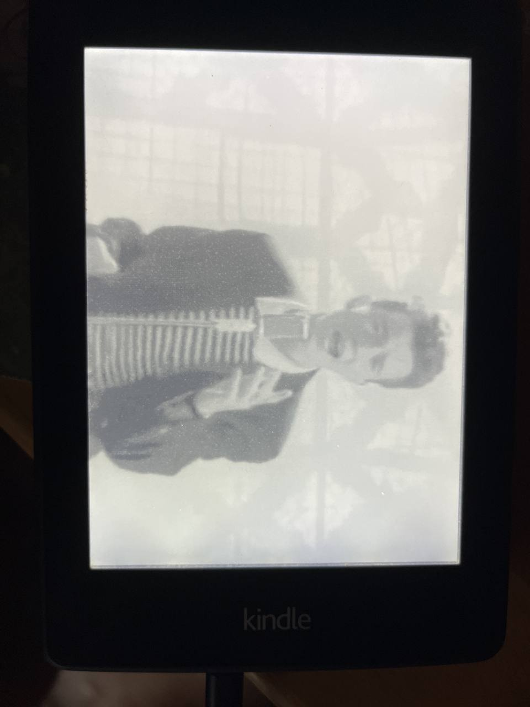

# Kindle Rickroll

This turns a Kindle Paperwhite into a Rickroll machine. It's a simple script that runs on the Kindle and plays a
Rickroll gif.

## What's what

* `start.sh`: Displays all frames of the gif with a 0.5s delay
* `config.xml`: KUAL config file
* `menu.json`: KUAL menu file

## Kindle preparation:

* jailbreak the kindle (see [here](https://www.mobileread.com/forums/showthread.php?t=186645) for more info
* Install KUAL (see [here](https://www.mobileread.com/forums/showthread.php?t=203326) for more info
* Install MRInstaller (this should be insalled with KUAL anyway, additionally this includes fbink)

## Installation:

* create directory `/mnt/us/extensions/rickroll`
* copy everything to the newly created directory

## Starting

Open up KUAL and press 'Rickroll'

## Stopping

The Rickroll will stop automatically after the gif has been played once, although you need to lock and unlock the screen after playing to get it displaying things correctly again.

## Todo

* [ ] Clear / reset the screen after the gif has been played
* [ ] Add a way to stop the Rickroll
* [ ] Rotate the screen by 90 degrees

## Credits

* mattzzw for the kindle-clock](https://github.com/mattzzw/kindle-clock) project, which I used as a starting point